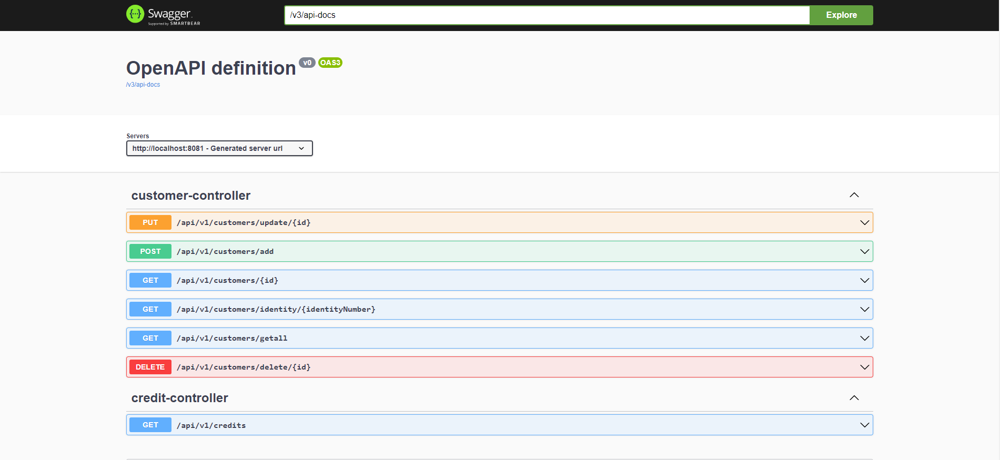

# LoanApplicationSystem

## 1 Projenin Amacı

Bir kredi başvuru sistemi için, kredi başvuru isteklerini alıp ilgili kriterlere göre müşteriye 
kredi sonucunu dönen servisin içinde yer alacak restful bir uygulamanın Spring Boot framework kullanılarak yazılması

## 1.1 Kullanılan Teknolojiler

* Java 17
* Spring Boot 3.0
* Spring Framework
* PostgreSql
* H2Database(Test)
* Junit5
* Sonarqube
* Angular

## 1.2 Nasıl Çalışıyor

Uygulama yukarıdaki proje amacında da belirtildiği gibi müşteri talebine odaklı 
işlemler gerçekleştiriyor. 

### 1.2.1 Yeni Müşteri Ekleme
Kullanıcı gerekli bilgileri servise göndererek,işlemleri
başlatıyor. Gerekli kontroller yapıldıktan sonra uygun olmayan istekler bir 
hata mesajı döndürülerek reddediliyor. Uygun istek geldiğinde ise bu istekten gelen
bilgi müşteri olarak veritabanına ekleniyor. Daha sonra 0-4000 arasında bir kredi 
notu sistem tarafından tamamen rastgele belirleniyor. Kredi notu, aylık gelir ve 
teminat bilgilerine göre bir kredi hesabı yapılıyor. Bu hesap sonucu veriler 
veritabanındaki kredi tablosuna ekleniyor. 

### 1.2.2 Müşteri Güncelleme
Daha önceden eklenen bir müşterinin bilgilerini güncelleme işlemidir. 
Kullanıcı bilgileri güncellenirken aylık gelir ve teminat bilgilerinde güncelleme
yapıldığı takdirde, bu durum müşterinin kredi başvurusunu doğrudan 
etkilediği için kredi hesabı tekrar yapılır. Eski kredi notları sistemde
kalmaya devam eder ancak kullanıcı sadece güncel kredi başvuru sonucunu görüntüleyebilir.

> Kredi notu kullanıcı ilk kez eklenirken oluşturulur ve daha sonra değiştirilemez.

### 1.2.3 Müşteri Silme
Daha önceden eklenen bir müşterinin bilgilerini ve tüm kredi başvuru kayıtlarını
silme işlemidir. 

### 1.2.4 Yeni Kredi Başvurusu
Yeni müşteri ekleme işlemi başarıyla gerçekleştiğinde, sistem tarafından 
eklenen müşteri için bir yeni kredi başvurusu oluşturulur.

### 1.2.5 Kredi Başvurusu Güncelleme
Kredi başvurusu güncelleme koşulu, var olan müşterinin güncellenirken eski ve yeni
aylık gelir ve/veya teminat bilgilerinin değişmesi ile gerçekleşir.

### 1.2.6 Kredi Başvurusu Silme
Bu işlem müşteri silme işlemine bağlıdır.

### 1.2.7. Kredi Başvurusu Görüntüleme
Talep edilen kredi başvuru bilgisi için servise, müşterinin sisteme kayıt ettiği 
kimlik numarası ve doğum tarihi bilgisi gönderilir. Bu bilgilerin birbirini tutması 
şarttır. Aksi halde bir hata mesajı döndürülür. Bilgilerin birbirine uygun olduğu 
durumda hem müşteri bilgileri hem de müşterinin aktif kredi başvurusu döndürülür.

## 2 Teknik Bilgiler

## 2.1 Swagger
Servisin swagger implementasyon yapılmıştır.

Görsel 1

Aşağıdaki görsel swagger ile yapılan örnek bir isteği gösterir.

Görsel 2

## 2.2 Sonarqube
Servis geliştirilirken koddaki eksiklikleri gidermek ve kod kalitesini artırmak için 
sonarqube isimli statik kod analiz aracı kullanıldı.

Görsel 3

Görsel sonarqube ile yapılan ilk analizin sonucunu gösterir.

Görsel 4

Görsel 3'te bulunan açıklar yine Sonarqube önerileri kullanılarak giderildi.

## 3 Sunum
Bir SPA olan Angular kullanılarak geliştirildi. Angular'ın 14. versiyonunun yanında, 
angular ile çalışmanın gerekliliği olarak typescript, html, css gibi web geliştirme 
birimleri kullanıldı. Başlık 1.2.1 Yeni Müşteri Ekleme ve 1.2.7. Kredi Başvurusu 
Görüntüleme işlemlerini yapabilecek bir arayüz hazırlandı. Diğer işlemleri test etmek 
için swagger desteğinden yararlanabilirsiniz.

Arayüz için bahsedilen işlemlerin örnek görsellerine aşağıdan ulaşabilirsiniz.

Görsel 5

Görsel 6

Görsel 7

Görsel 8

Görsel 9

Görsel 10

Görsel 11